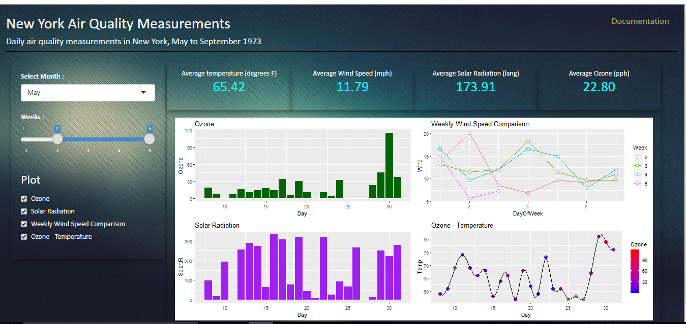
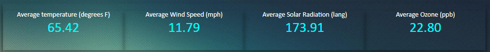

Dashboard For Analyzing New York Air Quality Measurements
========================================================
author: Jagadeesha
date: 8-Oct-2018
font-family: 'Calibri'

<style>
body {
  background-color:#EFEFEF;
}
.small-code pre code {
  font-size: 16px;
}
/* slide titles */
.reveal h3 { 
  font-size: 70px;
  color: #156209;
}

img{
margin-left:8px!important;
max-height:260px!important;
}

/* heading for slides with two hashes ## */
.reveal .slides section .slideContent h2 {
   font-size: 25px;
   color: #6C6F6C;
}

/* ordered and unordered list styles */
.reveal ul, 
.reveal ol {
    font-size: 25px;
    color: #6C6F6C;
    line-height:30px;
}

em{
  font-size: 20px!important;
  color: #6C6F6C;
  line-height:21px!important;
}

</style>

Application Description
========================================================


- **Input** : Dropdown to choose month, Slider to choose weeks and Checkbox list to choose plots.

- **Output** : Average of variables for selected duration displayed in tiles and 4 plots.

***

- Aim of this application is to provide a simple dashboard using shiny for air quality measurement dataset. 
- The `airquality` dataset provides daily air quality measurements in New York, May to September 1973.
  
- Following are the 4 plots based on selected period, provided to analyze the data. 
  + Mean Ozone per day.
  + Solar radiation per day.
  + Weekly wind speed comparison.
  + Ozone - Temperature per day.

Filtering the dataset based on inputs (month and weeks)
========================================================
class: small-code
- The `airquality` dataset is filtered when the user chooses the month and weeks in the user interface.
- *Example:* Suppose the user selects the month 'June' and weeks 2 to 4.

```r
sMonth <- 6 #input$month
sWeeks <- seq(2,4,1) #seq(input$week[1],input$week[2],1)
dataset <- airquality[airquality$Month==sMonth,]
dataset$Week <- ifelse((dataset$Day%%7)==0,(dataset$Day%/%7),(dataset$Day%/%7)+1) 
dataset$DayOfWeek <- ifelse((dataset$Day%%7)==0,7,(dataset$Day%%7)) 
dataset <- dataset[dataset$Week %in% sWeeks,]
head(dataset)
```

```
   Ozone Solar.R Wind Temp Month Day Week DayOfWeek
39    NA     273  6.9   87     6   8    2         1
40    71     291 13.8   90     6   9    2         2
41    39     323 11.5   87     6  10    2         3
42    NA     259 10.9   93     6  11    2         4
43    NA     250  9.2   92     6  12    2         5
44    23     148  8.0   82     6  13    2         6
```

Average of variables
========================================================
class: small-code


- Average of 4 variables for the selected duration are displayed in the tiles above the plot.
- R code in server.R file to generate the average of temperature *(Note: The code is not evaluated and hence the output is not displayed in the slide)*


```r
avgTemp <- reactive({
      paste0("<span class=\"tileText\">",
             format(round(mean(dataset$Temp, na.rm=TRUE), 2), nsmall = 2),"</span>")
    })
    output$tempAvg <- renderText({ 
      paste("Average temperature (degrees F)", avgTemp(), sep="<br/>")
    })
```
- Corresponding R code in ui.R

```r
column(width = 3, class="tile", htmlOutput("tempAvg")
```

Plots
========================================================
class: small-code
- The user defined R function `multiplot` allows the application to change the layout dynamically as per the number of plots selected by the user as shown below.
*(Note: The Code is lengthy and hence not displayed in the slide)*


*Source code is available at https://github.com/JagadeeshaKV/NewYorkAirQuality/*

***

- The server.R code to plot bar chart for ozone per day and its output are given below.


```r
    p1 <- ggplot(dataset, aes(x=Day, y=Ozone)) +
      geom_bar(stat="identity", fill="darkgreen")+
      ggtitle("Ozone")
    p1
```


*Shiny app is hosted at https://jagadeeshakv.shinyapps.io/NewyorkWeather/*
